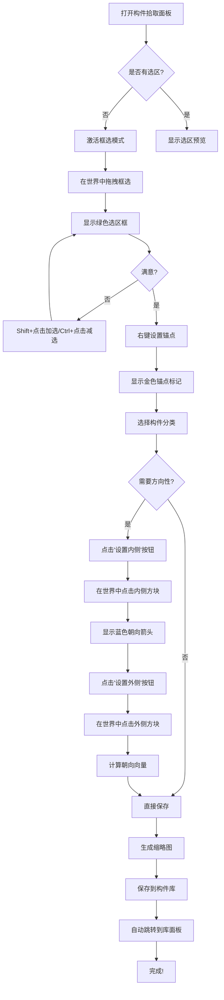

# 🎯 构件拾取面板设计 v2.0

## 📋 用户需求分析

### 当前问题
1. ❌ 需要在"工具"面板激活选区工具，然后切换到"构件拾取"面板
2. ❌ 只能框选，不能精细调整选区（加选/减选）
3. ❌ 锚点设置不够直观，没有明确的"朝向"和"附着面"概念
4. ❌ UI 控件缺少 Tooltip 提示

### 用户新需求
1. ✅ **内置选择工具**：在构件拾取面板直接进行选区操作
2. ✅ **多种选择模式**：框选、点选加/减
3. ✅ **构件语义配置**：内外、上下、附着面等
4. ✅ **完善的 Tooltip**：所有控件都有说明

## 🎨 设计方案

### 一、选择工具集成

#### 1.1 工具模式切换

在面板顶部添加工具栏：

```
┌────────────────────────────────────────┐
│ 🎯 构件拾取                            │
├────────────────────────────────────────┤
│ 选择模式: [📦框选] [➕点选] [➖减选]    │
│                                        │
│ 快捷键:                                │
│  • 左键拖拽 = 框选                     │
│  • Shift+左键 = 加选                   │
│  • Ctrl+左键 = 减选                    │
│  • 右键 = 设置锚点                     │
│  • 中键 = 快速预览                     │
└────────────────────────────────────────┘
```

#### 1.2 鼠标按键映射

| 按键组合 | 功能 | 说明 |
|---------|------|------|
| **左键拖拽** | 框选 | 拖拽形成 AABB 选区 |
| **Shift + 左键** | 加选 | 点击方块添加到选区 |
| **Ctrl + 左键** | 减选 | 点击方块从选区移除 |
| **右键** | 设置锚点 | 点击方块设为锚点 |
| **右键拖拽** | 调整朝向 | 拖拽方向决定朝向 |
| **中键** | 快速预览 | 按住中键旋转预览 |
| **滚轮** | 缩放预览 | 放大/缩小 3D 预览 |

#### 1.3 实现细节

**新增状态枚举**：
```java
public enum SelectionMode {
    BOX_SELECT,      // 框选
    ADD_SELECT,      // 点选加
    REMOVE_SELECT    // 点选减
}
```

**世界渲染层**：
```java
public class ComponentCaptureWorldOverlay {
    // 渲染选区边框（高亮）
    void renderSelection(DrawContext ctx);
    
    // 渲染锚点标记（十字准星）
    void renderAnchor(DrawContext ctx);
    
    // 渲染朝向箭头
    void renderFacing(DrawContext ctx);
    
    // 渲染附着面高亮
    void renderAttachmentFace(DrawContext ctx);
}
```

### 二、构件语义配置

#### 2.1 构件分类系统

**扩展 ComponentCategory**：
```java
public enum ComponentCategory {
    // 基础结构
    WALL("墙体", AttachmentMode.VERTICAL_EDGE),
    FLOOR("地板", AttachmentMode.BOTTOM_FACE),
    CEILING("天花板", AttachmentMode.TOP_FACE),
    ROOF("屋顶", AttachmentMode.TOP_FACE),
    COLUMN("柱子", AttachmentMode.BOTTOM_FACE),
    BEAM("梁", AttachmentMode.HORIZONTAL_EDGE),
    
    // 开口构件
    DOOR("门", AttachmentMode.VERTICAL_EDGE, Directionality.INSIDE_OUTSIDE),
    WINDOW("窗户", AttachmentMode.VERTICAL_EDGE, Directionality.INSIDE_OUTSIDE),
    ARCH("拱门", AttachmentMode.VERTICAL_EDGE),
    
    // 装饰构件
    DECORATION("装饰", AttachmentMode.ANY_FACE),
    FURNITURE("家具", AttachmentMode.BOTTOM_FACE),
    LIGHTING("照明", AttachmentMode.ANY_FACE),
    
    // 特殊构件
    STAIR("楼梯", AttachmentMode.BOTTOM_FACE, Directionality.UP_DOWN),
    BALCONY("阳台", AttachmentMode.VERTICAL_EDGE, Directionality.INSIDE_OUTSIDE),
    CHIMNEY("烟囱", AttachmentMode.ROOF_EDGE, Directionality.UP_DOWN);
    
    private final String displayName;
    private final AttachmentMode defaultAttachment;
    private final Directionality directionality;
}
```

#### 2.2 附着模式（AttachmentMode）

定义构件如何附着到建筑：

```java
public enum AttachmentMode {
    // 面附着
    BOTTOM_FACE("底面", "构件底部贴合表面（如地板、柱子）"),
    TOP_FACE("顶面", "构件顶部贴合表面（如天花板）"),
    ANY_FACE("任意面", "可附着到任何面（如装饰）"),
    
    // 边附着
    VERTICAL_EDGE("竖边", "附着到竖直边缘（如门窗）"),
    HORIZONTAL_EDGE("横边", "附着到水平边缘（如梁）"),
    ROOF_EDGE("屋顶边", "附着到屋顶边缘（如烟囱）"),
    
    // 特殊
    FREESTANDING("独立", "不需要附着，独立放置"),
    EMBEDDED("嵌入", "嵌入到墙体或结构中");
}
```

#### 2.3 方向性（Directionality）

定义构件的方向语义：

```java
public enum Directionality {
    NONE("无", "无特定方向"),
    
    // 内外方向
    INSIDE_OUTSIDE("内外", "有明确的内侧和外侧（如门窗）",
        new String[]{"内侧", "外侧"}),
    
    // 上下方向
    UP_DOWN("上下", "有明确的上端和下端（如楼梯）",
        new String[]{"下端", "上端"}),
    
    // 前后方向
    FRONT_BACK("前后", "有明确的正面和背面（如家具）",
        new String[]{"背面", "正面"}),
    
    // 左右方向
    LEFT_RIGHT("左右", "有明确的左右（如对称装饰）",
        new String[]{"左", "右"}),
    
    // 四向
    FOUR_WAY("四向", "可旋转四个方向（如柱子）",
        new String[]{"北", "东", "南", "西"});
    
    private final String name;
    private final String description;
    private final String[] labels;
}
```

### 三、UI 布局设计

#### 3.1 整体布局（垂直滚动）

```
┌─────────────────────────────────────────────────┐
│ 标签栏: [💬聊天] [🧰工具] [📚库] [🎯拾取] [⚙️设置] │
├─────────────────────────────────────────────────┤
│                                                 │
│  ┌──────────────────────────────────────┐      │
│  │  🎯 构件拾取                          │      │
│  ├──────────────────────────────────────┤      │
│  │                                      │      │
│  │  ▼ 选择工具                          │      │
│  │  ┌────────────────────────────────┐  │      │
│  │  │ 模式: [📦框选] [➕加] [➖减]    │  │      │
│  │  │                                │  │      │
│  │  │ 当前选区: 5×3×4 (60 方块)     │  │      │
│  │  │ 锚点: (100, 64, 200) ✓         │  │      │
│  │  └────────────────────────────────┘  │      │
│  │                                      │      │
│  │  ▼ 缩略图预览                        │      │
│  │  ┌────────────┐                     │      │
│  │  │            │  [🔄重新生成]       │      │
│  │  │   3D 预览  │                     │      │
│  │  │            │                     │      │
│  │  └────────────┘                     │      │
│  │                                      │      │
│  │  ▼ 基础信息                          │      │
│  │  构件名称: [__________________]      │      │
│  │  构件分类: [🚪 门] ▼                │      │
│  │  标签: [modern, wooden]             │      │
│  │                                      │      │
│  │  ▼ 附着与朝向                        │      │
│  │  附着模式: [竖边附着] ▼              │      │
│  │  方向性: [内外] ▼                    │      │
│  │  ┌────────────────────────────────┐  │      │
│  │  │  锚点朝向: 向南 ➡️               │  │      │
│  │  │  [🎯重新设置]  [🔄旋转]         │  │      │
│  │  └────────────────────────────────┘  │      │
│  │  ┌────────────────────────────────┐  │      │
│  │  │  内侧标记: 已设置 ✓             │  │      │
│  │  │  外侧标记: 已设置 ✓             │  │      │
│  │  │  [🏠设置内侧]  [🌍设置外侧]     │  │      │
│  │  └────────────────────────────────┘  │      │
│  │                                      │      │
│  │  ▼ 智能分析                          │      │
│  │  [🤖 自动识别分类]                   │      │
│  │  [🔍 检测 Socket]                    │      │
│  │  [📐 优化边界]                       │      │
│  │                                      │      │
│  │  ▼ Socket 配置 (高级)                │      │
│  │  Socket ID: [__________]            │      │
│  │  上下文: [Door_Frame] ▼              │      │
│  │  [➕添加] [👁️预览] [🗑️清空]          │      │
│  │                                      │      │
│  │  ┌────────────────────────────────┐  │      │
│  │  │ [❌取消]          [💾保存构件]  │  │      │
│  │  └────────────────────────────────┘  │      │
│  └──────────────────────────────────────┘      │
│                                                 │
└─────────────────────────────────────────────────┘
```

#### 3.2 交互式设置流程

**流程 1：设置门构件**
```
1. 用户框选一个门
2. 系统自动识别 → 分类: 门
3. 系统提示: "请右键点击门的锚点（底部中心）"
4. 用户右键设置锚点
5. 系统提示: "请点击'设置内侧'，然后在世界中点击内侧方块"
6. 用户点击按钮，进入内侧标记模式
7. 用户在世界中点击门内侧的一个方块
8. 系统计算朝向：内→外
9. 同样设置外侧
10. 完成！缩略图更新显示朝向箭头
```

**流程 2：设置楼梯构件**
```
1. 用户框选楼梯
2. 选择分类: 楼梯
3. 系统提示: "请设置下端锚点"
4. 用户右键点击楼梯底部
5. 系统提示: "请点击'设置上端'按钮"
6. 用户点击按钮并在世界中标记上端
7. 系统计算上下朝向
8. 完成！
```

### 四、视觉反馈系统

#### 4.1 世界渲染覆盖层

**选区高亮**：
```java
// 绿色半透明选区边框
Color: rgba(0, 255, 0, 0.3)
Line width: 2px
Pattern: Solid
Animation: 呼吸效果（明暗变化）
```

**锚点标记**：
```java
// 3D 十字准星
Color: rgba(255, 200, 0, 1.0) // 金黄色
Size: 0.5 方块
Style: 实心球体 + 十字线
Label: "锚点" + 坐标
```

**朝向箭头**：
```java
// 大箭头指示朝向
Color: rgba(0, 150, 255, 0.8) // 蓝色
Length: 1.5 方块
Width: 0.3 方块
Style: 3D 箭头 + 末端标签（"外侧"/"前方"）
Animation: 箭头闪烁
```

**附着面高亮**：
```java
// 高亮附着的那个面
Color: rgba(255, 100, 0, 0.5) // 橙色
Style: 面覆盖 + 边框加粗
Pattern: 网格纹理
```

#### 4.2 Tooltip 系统

**所有控件都添加详细 Tooltip**：

```java
// 示例：框选按钮
button.setTooltip(Tooltip.of(Text.literal(
    "框选模式\n" +
    "━━━━━━━━━━━━\n" +
    "• 左键拖拽: 框选区域\n" +
    "• ESC: 取消选择\n" +
    "• 提示: 尽量框选完整的结构"
)));

// 示例：锚点按钮
button.setTooltip(Tooltip.of(Text.literal(
    "设置锚点\n" +
    "━━━━━━━━━━━━\n" +
    "锚点是构件的参考原点。\n" +
    "建议设置在:\n" +
    "• 门窗: 底部中心\n" +
    "• 柱子: 底部中心\n" +
    "• 装饰: 附着点\n" +
    "• 家具: 底部中心或前侧中心"
)));

// 示例：内侧按钮
button.setTooltip(Tooltip.of(Text.literal(
    "设置内侧\n" +
    "━━━━━━━━━━━━\n" +
    "定义构件的内侧方向。\n" +
    "1. 点击此按钮\n" +
    "2. 在世界中点击内侧的方块\n" +
    "3. 系统自动计算朝向\n\n" +
    "用途: AI 放置时会自动朝向正确"
)));
```

#### 4.3 状态指示器

**选区状态栏**：
```
┌─────────────────────────────────────┐
│ ✓ 选区: 5×3×4 (60 方块)            │
│ ✓ 锚点: 已设置 (100, 64, 200)      │
│ ✓ 朝向: 向南                        │
│ ⚠ 内外侧: 未设置                   │
│ ⚠ Socket: 未配置                   │
└─────────────────────────────────────┘
```

**进度提示**：
```
步骤 1/4: ✓ 选择方块
步骤 2/4: ✓ 设置锚点  
步骤 3/4: ⚠ 配置朝向 ← 当前
步骤 4/4: ⚪ 保存构件
```

### 五、数据结构扩展

#### 5.1 ComponentDefinition 扩展

```java
public class ComponentDefinition {
    // 现有字段...
    public List<BlockEntry> blocks;
    public BlockPos anchor;
    public Direction facing;
    
    // 新增字段
    public ComponentCategory category;
    public AttachmentMode attachmentMode;
    public Directionality directionality;
    
    // 方向标记（如果有方向性）
    public DirectionMarkers markers;
    
    public static class DirectionMarkers {
        // 内外标记（用于门窗）
        public BlockPos insideMark;   // 内侧标记点
        public BlockPos outsideMark;  // 外侧标记点
        
        // 上下标记（用于楼梯）
        public BlockPos bottomMark;   // 下端标记点
        public BlockPos topMark;      // 上端标记点
        
        // 前后标记（用于家具）
        public BlockPos frontMark;    // 正面标记点
        public BlockPos backMark;     // 背面标记点
    }
    
    // 自动计算的朝向向量
    public Vec3d computedDirection() {
        if (markers == null) return null;
        
        switch (directionality) {
            case INSIDE_OUTSIDE:
                if (insideMark != null && outsideMark != null) {
                    return Vec3d.of(outsideMark.subtract(insideMark));
                }
                break;
            case UP_DOWN:
                if (bottomMark != null && topMark != null) {
                    return Vec3d.of(topMark.subtract(bottomMark));
                }
                break;
            // ... 其他方向
        }
        return null;
    }
}
```

### 六、实现优先级

#### Phase 1: 选择工具集成（高优先级）
- ✅ 在 ComponentCapturePanel 添加选择模式切换
- ✅ 实现框选、点选加、点选减三种模式
- ✅ 实现世界渲染覆盖层（选区、锚点）
- ✅ 添加键盘快捷键支持

#### Phase 2: 基础 Tooltip（高优先级）
- ✅ 为所有现有按钮添加 Tooltip
- ✅ 添加简洁的使用说明
- ✅ 添加快捷键提示

#### Phase 3: 构件语义配置（中优先级）
- ✅ 扩展 ComponentCategory
- ✅ 添加 AttachmentMode 和 Directionality
- ✅ 实现方向标记系统
- ✅ UI 中添加配置选项

#### Phase 4: 视觉增强（中优先级）
- ✅ 朝向箭头渲染
- ✅ 附着面高亮
- ✅ 状态指示器
- ✅ 进度提示

#### Phase 5: 智能辅助（低优先级）
- ⚪ 自动识别构件类型
- ⚪ 智能推荐锚点位置
- ⚪ 智能检测内外侧
- ⚪ 自动优化选区边界

### 七、用户体验流程图



---

## 📝 总结

这个设计方案实现了：

1. ✅ **独立的选择工具**：不再依赖工具面板
2. ✅ **多种选择模式**：框选、点选加/减
3. ✅ **完善的语义配置**：分类、附着、方向性
4. ✅ **丰富的视觉反馈**：高亮、箭头、标记
5. ✅ **详细的 Tooltip**：每个控件都有说明
6. ✅ **直观的交互流程**：一步步引导用户

**核心优势**：
- 🎯 所有操作在一个面板内完成
- 🎨 丰富的视觉反馈，实时可见
- 📚 详细的 Tooltip，自学习友好
- 🧠 智能辅助功能，降低学习成本
- 🔧 灵活的配置选项，适应不同构件类型

**版本**: v2.0 (完整设计)  
**创建时间**: 2026-01-14  
**设计者**: AI + 用户需求
