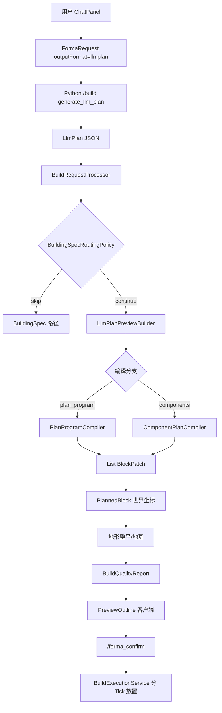

# FormaCraft 生成管线（唯一流程真相）

> 本文描述 **2026-07 代码现状** 下，从用户请求到方块放置的完整链路。  
> 若与其他 `COMPLETE_*` / `*_SUMMARY` 文档冲突，**以本文 + [ARCHITECTURE.md](../ARCHITECTURE.md) 为准**。

---

## 设计立场

- **泛化优先**：一般建筑由 LLM 输出 `LlmPlan.components[]`，经参数化 `ComponentGenerator` 拼装。
- **精品库例外**：著名地标 / 高置信度 archetype / 显式 `landmark:` 模块引用，可走整栋 `StructureGenerator`。
- **AI 不直接放方块**：LLM 只输出语义 JSON；Java 负责几何、材质、地形、约束。

---

## 三条顶层入口

| 路径 | 触发 | 关键类 |
|------|------|--------|
| **A. LlmPlan 构件拼装（主路径）** | 后端返回 `AiPlanResult.LlmPlan` | `BuildRequestProcessor` → `LlmPlanPreviewBuilder` → `ComponentPlanCompiler` |
| **B. BuildingSpec 整栋生成（并行路径）** | 后端返回 `AiPlanResult.BuildingSpec` | `BuildRequestProcessor.previewBuildingSpec` → `GenerationHub.routeStructure` → `GeneratorRouter` |
| **C. Patch 增量** | `LlmPlan.mode=patch` 且含 `patch.blocks` | `LlmPlanPreviewBuilder` → `PatchPreviewService` |

**注意**：LlmPlan 预览失败**不再**回退假 BuildingSpec（`BuildRequestProcessor`）；用户需调整请求或检查后端。

---

## 路径 A：LlmPlan → 预览 → 确认建造



### 阶段 1 — 请求与路由

| # | 阶段 | 类 / 文件 |
|---|------|-----------|
| 1 | 客户端发 C2S 建造请求 | `FormaCraftClientNetworking` |
| 2 | 服务端处理 | `server/network/BuildRequestProcessor.java` |
| 3 | 调用 Python 编排器 | `OrchestratorClient` → `python_backend/app/routes/build.py` |
| 4 | 是否跳过 LlmPlan（如特定关键词整栋路由） | `common/generation/routing/BuildingSpecRoutingPolicy.java` |
| 5 | Patch 模式分流 | `BlockPatchBridge` → `PatchPreviewService` |

### 阶段 2 — 编译为 BlockPatch

| # | 条件 | 编译器 |
|---|------|--------|
| 6a | `plan_program` / `plan_skeleton` 存在 | `common/compiler/PlanProgramCompiler.java` |
| 6b | 默认 `components[]` | `server/compiler/ComponentPlanCompiler.java` |

**ComponentPlanCompiler 内部步骤：**

1. 类型规范化、别名、`StyleIntentResolver` 风格补全
2. 对 `MASS_*` 自动推断 `FACADE_WINDOWS` / `ENTRANCE` / `ROOF`（可选 Assembly 立面）
3. 构建 `SemanticComponent`
4. **`GenerationHub.generateComponent`** → **`UnifiedGeneratorRouter`**
5. slot 坐标合并：**BlockPatch 坐标相对 `plan.anchor`**；默认 slot 锚点为 `(0,0,0)`（非绝对世界坐标）
6. **`PostProcessPipeline`**：细节增强 → 材质变化 →（可选）地形适应

### 阶段 3 — UnifiedGeneratorRouter 优先级

文件：`server/generation/component/adaptor/UnifiedGeneratorRouter.java`

```
1. params.skeleton / feature "skeleton:"  → SkeletonExecutors
2. ComponentGeneratorRegistry             → ComponentGenerator.generate()
3. feature "group_request:" / "component_request:" → 玩家构件扩展
4. 显式 landmark/module/structure_generator → StructureGeneratorAdaptor
   → GenerationHub.routeStructure(BuildingSpec)
```

**安全策略**：已注册 `ComponentGenerator` 返回空时**不会**自动回退整栋生成器；回退需显式 routing hint。

### 阶段 4 — 预览后处理（LlmPlanPreviewBuilder）

| # | 阶段 | 类 |
|---|------|-----|
| 7 | BlockPatch → PlannedBlock（`planOrigin + dx,dy,dz`） | `LlmPlanPreviewBuilder` |
| 8 | 地形 pad 范围计算 | `LlmPlanTerrainBounds` |
| 9 | 地形整平 / 填土 | `TerrainFit` |
| 10 | 地基（台阶/支柱） | `FoundationPlanner`, `TerrainAdaptationEngine` |
| 11 | 质量检查 | `BuildPreviewPipeline` / `BuildQualityReport` |
| 12 | 存储预览 + 发送轮廓 | `PreviewStorage`, `FormaCraftServerNetworking` |

### 阶段 5 — 确认放置

| # | 阶段 | 类 |
|---|------|-----|
| 13 | `/forma_confirm` / `force` | `FormaCraftCommands` |
| 14 | 分 Tick 建造 | `BuildExecutionService` |

---

## 路径 B：BuildingSpec 整栋生成

```
BuildingSpec → GenerationHub.routeStructure()
  → GeneratorRouter（优先级见下）
  → StructureGenerator.generate()
  → PlannedBlock → 预览/建造
```

**GeneratorRouter 优先级**（`server/generation/structure/router/GeneratorRouter.java`）：

1. `extra.styleProfileId` → `StructureRouteCatalog`
2. `extra.assembly` → `MetaAssemblyGenerator`
3. `extra.blueprint` → `BlueprintStructureGenerator`
4. `extra.template` → `structure_routes_v1.json` 关键词
5. `extra.landmark` → `ArchetypeRegistry`
6. `genome.archetype.confidence ≥ 0.85` → archetype 路由
7. `BuildingType` → buildingTypeFallback

---

## 参数化 ComponentGenerator 一览

注册表：`common/generation/component/ComponentGeneratorRegistry.java`  
实现：`common/generation/component/impl/`（18 类）

| 生成器 | 泛化程度 | 说明 |
|--------|----------|------|
| `MassMainGenerator` | **高** | 主体体块；shape/plan_type/facade/masses[] |
| `FacadeWindowsGenerator` | **高** | 立面窗；window_ratio, rhythm |
| `RoofGenerator` | **高** | 坡顶/悬山/歇山/穹顶；roof_type, overhang |
| `EntranceGenerator` | **中高** | 门廊/雨棚 |
| `TowerComponentGenerator` | **中** | 圆形塔 |
| `WallComponentGenerator` | **中** | 矩形墙段 |
| `CourtyardSpaceGenerator` | **中** | 庭院铺装 |
| `PathComponentGenerator` / `RoadGenerator` | **中低** | 路径/道路 |
| `KeepGenerator` / `GateGenerator` | **低** | 硬编码拓扑，待参数化 |
| `StructureGeneratorAdaptor` | **混合** | 整栋生成器 → BlockPatch 适配（地标回退） |

**尺寸约定**：`dimensions.width/depth/height` = **方块数量**（如 15×20 = 15 格宽 × 20 格深）。  
`MASS_*` 默认 `relative_position` 为 footprint **中心**；`anchor_mode=min_corner` 时为最小角。

---

## 后处理 vs 约束过滤

| 管道 | 位置 | 当前接线状态 |
|------|------|--------------|
| `PostProcessPipeline` | `common/compiler/postprocess/` | ✅ 在 `ComponentPlanCompiler` 中调用 |
| `PatchFilterPipeline` | `common/patch/filter/` | ⚠️ 设计完整，**当前 Java 未在其他类调用** |
| `ServerPatchFilter` | `server/patch/` | ✅ Patch 预览签发 |
| `ToolPatchFilter` | `client/patch/filter/` | ✅ 客户端工具约束 |

---

## Prompt 与 Schema

| 组件 | 路径 |
|------|------|
| Plan DTO | `common/llm/dto/LlmPlan.java`, `Component.java`, `Dimensions.java` |
| Prompt 组装 | `ai/prompt/PromptAssembler.java` |
| 系统 Schema | `ai/prompt/PromptSystemSections.java` |
| 空间约束 | `ai/prompt/PromptSpatialSections.java` |
| 地标模块清单 | `LandmarkModuleRegistry` → `PromptSystemSections.landmarkModulesPrompt()` |
| Python 校验 | `python_backend/app/models/llm_plan.py` |
| 回归门 | `python_backend/eval/golden_eval.py` |

---

## 相关文档

- [GENERALIZATION_STRATEGY.md](GENERALIZATION_STRATEGY.md) — 泛化差距与演进
- [GENERATOR_ROUTING_MAP.md](GENERATOR_ROUTING_MAP.md) — 路由对照表
- [LLMPLAN_SYSTEM_CORE_PHILOSOPHY.md](LLMPLAN_SYSTEM_CORE_PHILOSOPHY.md) — 设计哲学
- [MIGRATION_LLMPLAN_VS_BUILDINGSPEC.md](MIGRATION_LLMPLAN_VS_BUILDINGSPEC.md) — 覆盖矩阵
